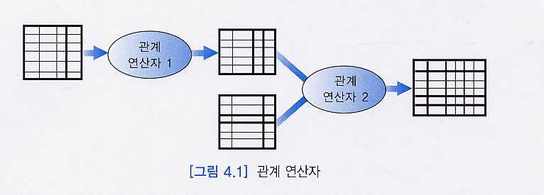
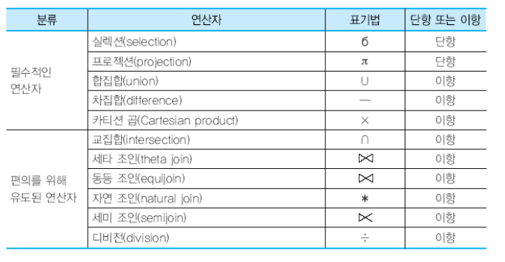
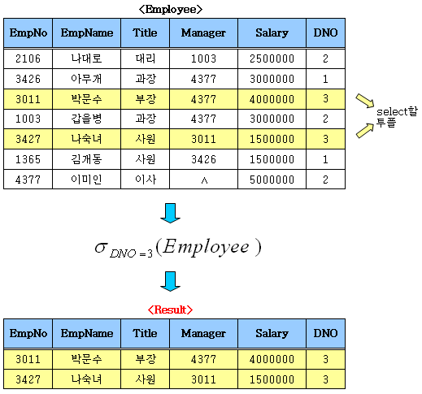
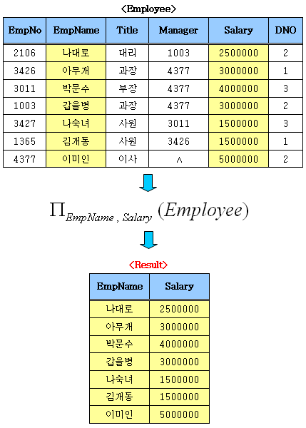

# 관계 대수

## 관계 데이터 모델에서 지원되는 두 가지 정형적인 언어

1. **관계 해석(relational calculus)**: ****원하는 데이터만 명시하고 질의를 어떻게 수행할 것인가는 명시하지 않는 **선언적 언어**
2. **관계 대수(relational algebra)**: 어떻게 질의를 수행할 것인가를 명시하는 **절차적 언어**
    - 하나 이상의 릴레이션에 적용되는 연산자들을 포함
    - 연산자들은 주어진 릴레이션들로부터 새로운 릴레이션을 생성
    - 상용 관계 DBMS에서 널리 사용되는 SQL의 이론적인 기초
    - SQL을 구현하고 최적화하기 위해 DBMS의 내부 언어로서도 사용

## 연산자

### 순수 관계 연산자

> 관계형 데이터베이스에서만 사용하는 연산자

1. **실렉션**: 한 릴레이션에서 **실렉션 조건**(selection condition)을 만족하는 투플들의
부분 집합을 생성함

    

    

    - 결과 릴레이션의 차수는 입력 릴레이션의 차수와 같음
    - 결과 릴레이션의 카디날리티는 항상 원래 릴레이션의 카디날리티보다
    작거나 같음
    - 실렉션 조건을 **프레디키트**(predicate)라고도 함
    - 실렉션 조건은 일반적으로 릴레이션의 임의의 **애트리뷰트**와 **상수**, `= , <>,
    <=, <, >=, >` 등의 **비교 연산자**, `AND, OR, NOT` 등의 **부울 연산자**를 포함할
    수 있음

    

2. **프로젝션**: 한 릴레이션의 **애트리뷰트들의 부분 집합**을 구함

    

    

    - 결과로 생성되는 릴레이션은 <애트리뷰트 리스트>에 명시된
     애트리뷰트들만 가짐
    - 실렉션의 결과 릴레이션에는 중복 투플이 존재할 수 없지만, 프로젝션
    연산의 결과 릴레이션에는 **중복된 투플들이 존재할 수 있음**

    

3. **조인**: 두 개의 릴레이션으로부터 **연관된 투플들을 결합**하는 연산자
    - 관계 데이터베이스에서 두 개 이상의 릴레이션들의 관계를 다루는데 매우
    중요한 연산자
    - 세타 조인(theta join), 동등 조인(equi join), 자연 조인(natural join), 외부
    조인(outer join), 세미 조인(semi join) 등
    1. **세타 조인**과 **동등 조인**

        

        - 두 릴레이션 R(A1, A2, ..., An)과 S(B1, B2, ..., Bm)의 세타 조인의 결과는
        **차수가 n+m**이고, **애트리뷰트가 (A1, A2, ..., An, B1, B2, ..., Bm)**이며,
        조인 조건을 만족하는 투플들로 이루어진 릴레이션
        - **세타**는 `=, <>, <=, <, >=, >` 중의 하나
        - **동등** 조인은 **세타 조인 중**에서 비교 연산자가 `=`인 조인
    2. **자연 조인**

        

        - 동등 조인의 결과 릴레이션에서 **조인 애트리뷰트를 제외**한 조인
        - 여러 가지 조인 연산자들 중에서 **가장 자주 사용**됨
        - 실제로 관계 데이터베이스에서 대부분의 질의는 실렉션, 프로젝션, 자연
        조인으로 표현 가능
4. **디비전**: S의 모든 투플에 연관되어 있는 R의 투플을 선택하는 것

    

    

### 일반 집합 연산자

> 집합 연산자의 입력으로 사용되는 두 개의 릴레이션은 **합집합 호환(union
compatible)**이어야 함

> **합집합 호환**: 주 릴레이션의 애트리뷰트 수가 같고 대응되는 애트리뷰트들의 도메인이 같음

1. **합집합**: 두 릴레이션 R과 S의 합집합 `R ∪ S`는 **R 또는 S에 있거나 R과 S 모두에
속한** 투플들로 이루어진 릴레이션
    - 결과 릴레이션에서 **중복된 투플들은 제외**됨
    - 결과 릴레이션의 차수는 R 또는 S의 차수와 같으며, 결과 릴레이션의
    애트리뷰트 이름들은 R의 애트리뷰트들의 이름과 같거나 S의
    애트리뷰트들의 이름과 같음
2. **교집합**: 두 릴레이션 R과 S의 교집합 `R ∩ S`는 **R과 S 모두에 속한** 투플들로
이루어진 릴레이션
    - 결과 릴레이션의 차수는 R 또는 S의 차수와 같으며, 결과 릴레이션의
    애트리뷰트 이름들은 R의 애트리뷰트들의 이름과 같거나 S의
    애트리뷰트들의 이름과 같음
3. **차집합**: 두 릴레이션 R과 S의 차집합 `R - S`는 **R에는 속하지만 S에는 속하지 않은**
투플들로 이루어진 릴레이션
4. **카티션 프로덕트**: 두 릴레이션 R과 S의 `R × S`는 **두 릴레이션의 현재 투플로 구성 가능한 모든 조합**으로 이루어진 릴레이션
    - 결과 릴레이션의 **크기가 매우 클** 수 있으며, 사용자가 실제로
    원하는 것은 **카티션 곱의 결과 릴레이션의 일부인 경우가 대부분**이므로
    카티션 곱 자체는 유용한 연산자가 아님

### 기타 연산자

1. **세미 조인**

    

    - 조인 대상 릴레이션 중 하나를 **프로젝트(PROJECT) 연산을 수행한 후 조인**을 하는 것
    
2. **외부 조인**: 상대 릴레이션에서 대응되는 튜플을 갖지 못하는 튜플이나 조인 애트리뷰트에 널 값이 들어 있는 튜플들을 다루기 위해서 조인 연산을 확장한 것
    - 두 릴레이션에서 대응되는 튜플들을 결합하면서 **대응되는 튜플을 갖지 않는 튜플과 조인 애트리뷰트에 널 값을 갖는 튜플도 결과에 포함**
    1. **왼쪽 외부 조인(Left Outer Join)**: `R ⟕ S`는 **R의 모든 투플들을 결과에 포함**시키고, 만일 릴레이션 S에 관련된 투플이 없으면 결과 릴레이션에서 릴레이션 S의 애트리뷰트들은 널값으로 채움
    2. **오른쪽 외부 조인(Right Outer Join)**: `R ⟖ S` **S의 모든 투플들을 결과에 포함**시키고, 만일 릴레이션 R에 관련된 투플이 없으면 결과 릴레이션에서 릴레이션 R의 애트리뷰트들은 널값으로 채움
    3. **완전 외부 조인(Full Outer Join)**: `R ⟗ S` **R과 S의 모든 투플들을 결과에 포함**시키고, 만일 상대 릴레이션에 관련된 투플이 없으면 결과 릴레이션에서 상대 릴레이션의 애트리뷰트들은 널값으로 채움

## 완전성과 한계

### 관계대수의 완전성

- 관계대수의 필수적인 연산자를 제외한 연산자는 필수적인 연산자를 두가지 이상 조합하면 표현이 가능
- 임의의 질의어가 적어도 필수적인 연산자 만큼의 표현력을 가지고 있으면 관계적으로 완전(Relational Complete)하다고 표현

### 관계대수의 한계

- 관계대수는 산술연산이 불가능
- 집단함수(Aggregate Function)를 지원하지 않음
- 정렬을 나타낼 수 없음
- 데이터베이스의 수정이 불가능
