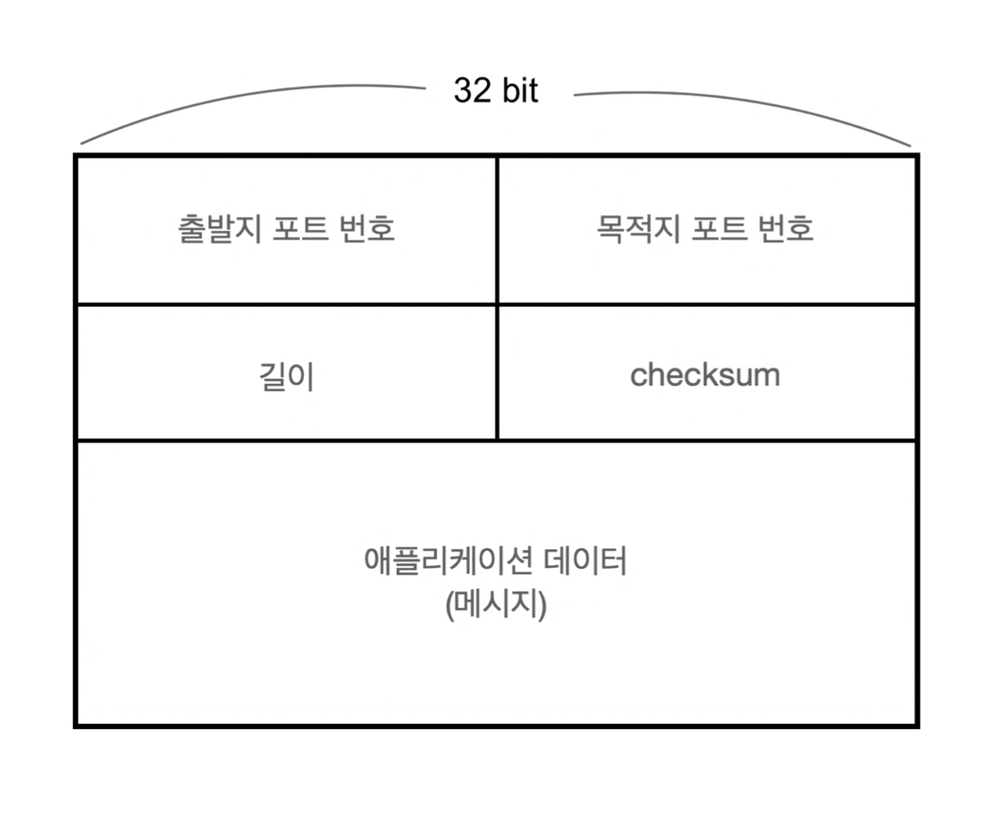
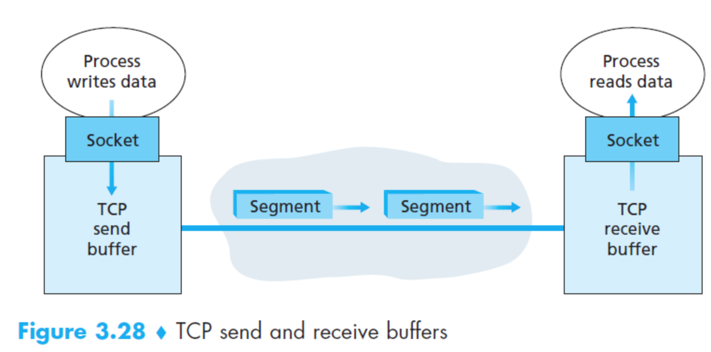

## 1. UDP

**User Datagram Protocol, 비연결형 트랜스포트**

UDP는 트랜스포트 계층 프로토콜이 할 수 있는 최소한 기능인 **다중화/역다중화 기능** 과 **간단한 오류 체크 기능(체크섬)** 만을  제공한다. 이는 애플리케이션과 네트워크 계층이 거의 직접 통신한다고 봐도 무방하다. 

- 무슨 데이터를 언제 보낼 지에 대해 애플리케이션 레벨에서 더 정교한 제어를 할 수 있다.

    : 혼잡 제어 메커니즘이 없기 때문에 지나치게 지연되는 세그먼트 전송을 원하지 않으며 조금의 데이터 손실을 허용한다. 애플리케이션은 UDP의 기본 전달 기능을 제외한 필요한 기능을 추가로 구현할 수 있다.

- 연결 설정이 없다.

    : 연결을 설정하는 과정이 없기 때문에 3-way handshake를 하는 TCP에 비해 초기 지연 시간이 없다.

- 연결 상태가 없다. (독립적이다.)

    : 연결 상태에 대해 기록하는 Parameter가 없기 때문에 일반적으로 특정 애플리케이션에 할당된 서버는 TCP보다 UDP에서 동작할 때 좀 더 많은 클라이언트를 수용할 수 있다.

- 작은 패킷 헤더 오버헤드

    : UDP - 8byte 헤드 오버헤드
      TCP - 20byte 헤드 오버헤드

    ### 1.1 UDP 헤더

## 2. TCP

**Transfer Control Protocol, 연결지향형 트랜스포트**

TCP는 신뢰적인 데이터 전송을 제공하기 위해 오류 검출(체크섬), 재전송(순서번호), 누적 확인응답, 타이머, 순서번호, 확인응답 번호를 위한 헤더필드를 포함한다.

- 연결 지향형

    : 데이터 전송 전, 연결설정인 handshaking 과정을 진행한다.

- 전이중(full-duplex) 서비스

    : 한 커넥션에서 애플리케이션 계층 데이터는  B → A 전달하는 동시에 A → B 로 흐를 수 있다.

      *MSS(madimum segment size): TCP 세그먼트의 목적지에서 수시할 수 있는 데이터 세그먼트의 최대 크기. 연결을 설정하는 세그먼트에서만 사용한다.(default: 536)

- 항상 점대점(point-to-point)

    : 항상 단일 송신자와 단일 수신자로 이루어져 있다.
      따라서 멀티캐스팅, 브로드캐스팅은 할 수 없다. 반면, UDP는 멀티캐스팅과 브로드캐스팅이 가능하다.

- 바이트 스트림(byte stream) 서비스

    : 데이터(메시지)의 경계가 없다.

- 파이프 라인 기법

    : TCP 흐름 제어와 혼잡 제어는 윈도우 사이즈를 설정한다.

    *혼잡 제어 메커니즘: 목적지 호스트들과 출발지 호스트들 사이에서 하나 이상의 링크가 과도하게 혼잡해지면, TCP 송신자를 조절한다.
    → TCP는 신뢰적인 절달이 얼마나 오래 걸리는 지에 상관없이 목적지가 세그먼트 수신 여부를 확인응답할 때까지 재전송을 계속한다.

### 2.1 송수신 버퍼

애플리케이션은 연결 양 끝에 각각 자신의 송신 버퍼와 수신 버퍼를 가지고 있다. 상대에게서 세그먼트를 받으면 세그먼트는 TCP 수신 버퍼에 위치한다. 애플리케이션은 이 버퍼에서 데이터의 스트림을 읽는다.

### 2.2 TCP 헤더

Sequence number: 순서 번호                        → 신뢰적인 데이터 전송을 위해 사용

Acknowledgement number: 확인응답 번호   → 신뢰적인 데이터 전송을 위해 사용

Header length: Options 필드가 가변이기 때문에 가변적인 길이가 될 수 있다.

Options: 선택적이고 가변적인 길이이다. 송신자와 수신자가 최대 세그먼트 크기(MSS)를 협상하거나 고속 네트워크에서 사용하기 위한 윈도우 확장 요소로 이용된다.

URG, RST, FIN: 연결 설정과 해제에 사용한다.

PSH: 비트가 설정되면 수신자가 데이터를 상위 게층에 즉시 전달해야한다는 것을 알려준다.

URG: urgent data pointer(긴급 데이터 포인터 필드)에 의해 가리켜진다.

Receive window: 리시버가 수용할 예정인 바이트 수 → 흐름 제어를 위해 사용

Internet checksum: 체크섬

## 3. TCP와 UDP 기본 흐름

---

**Q. TCP와 UDP의 공통점과 차이를 말하시오.**

A. TCP와 UDP는 공통적으로 포트번호를 이용하여 주소를 지정하고 데이터 오류 검출 기능을 합니다.

TCP는 연결형 서비스로 3-way handshaking 과정을 통해 연결을 설정합니다. 그렇기 때문에 높은 신뢰성을 보장하지만 속도가 비교적 느리다는 단점이 있습니다. UDP는 비연결형 서비스로 3-way handshaking을 사용하지 않기 때문에 신뢰성이 떨어지는 단점이 있습니다. 하지만 수신 여부를 확인하지 않기 때문에 속도가 빠릅니다. TCP는 신뢰성이 중요한 파일 교환과 같은 경우에 쓰이고 UDP는 실시간성이 중요한 스트리밍에 자주 사용됩니다.

Reference

- 도서 [컴퓨터 네트워킹(하향식 접근)](https://book.naver.com/bookdb/book_detail.nhn?bid=12500834)
- [https://mangkyu.tistory.com/91](https://mangkyu.tistory.com/91)
- [https://preamtree.tistory.com/42](https://preamtree.tistory.com/42)
